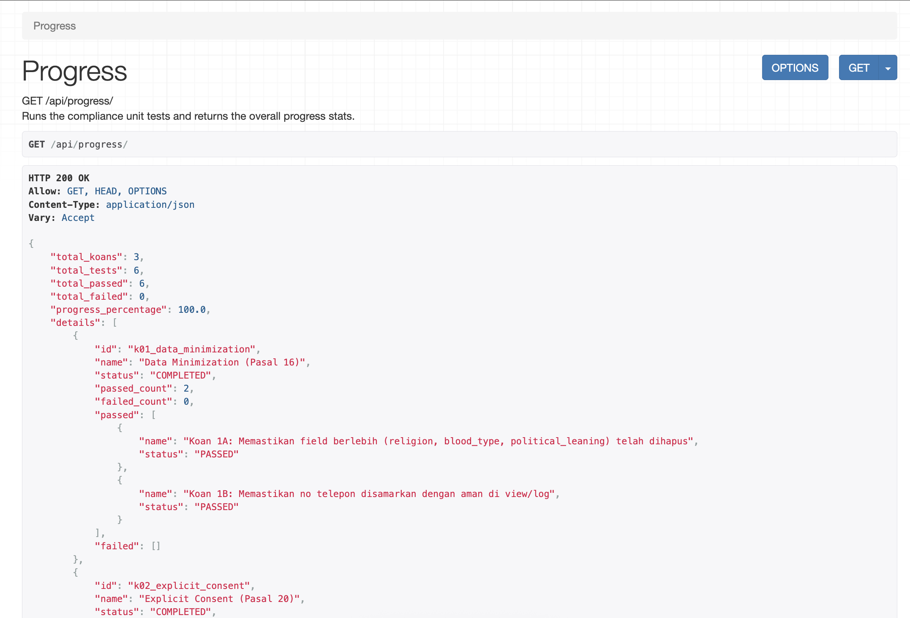

# PDP Koans (Django Edition) 🛡️

An interactive, Test-Driven Development (TDD) learning platform built in Django. This project is designed to help developers master the technical implementation of **Indonesian Personal Data Protection Law (UU PDP)** and **ISO 27001 security standards** on the backend.

Unlike traditional terminal-based Koans, this platform runs inside a Docker container and exposes a **progress API endpoint** to track your compliance level dynamically.

---

## 🌟 Key Features

* **Real-world Tech Stack**: Django, PostgreSQL, and Docker.
* **ISO 27001 Compliant**: Focuses on cryptography (A.8.24) and data minimisation principles.
* **On-Point Technical Focus**: Pure backend development, no frontend overhead.
* **Progress API Tracker**: Run test cases dynamically via `GET /api/progress/`.

---

## 🚦 Getting Started

### 1. Prerequisites
Ensure you have [Docker](https://docs.docker.com/get-docker/) and [Docker Compose](https://docs.docker.com/compose/install/) installed.

### 2. Clone and Spin Up the Services
Clone this repository and spin up the Docker containers:

```bash
docker compose up --build
```

The Django development server will start at `http://localhost:8000`.

### 3. Check Initial Progress
Open your browser or run curl to hit the progress API:

```bash
curl http://localhost:8000/api/progress/
```


**Initial Response:**
You will see that your completion rate is `0.0%` with failing unit tests because the compliance features are not yet implemented!

---

## ⚔️ The Koan Challenges

Your mission is to fix the security and privacy vulnerabilities in the code under the `koans/` directory.

### 🛡️ Koan 1: Data Minimisation (Pasal 16 UU PDP)
* **Goal**: Minimize stored user fields and protect data exposure.
* **Files to Edit**: [koans/k01_data_minimization/models.py](file:///app/koans/k01_data_minimization/models.py)
* **Task**:
  1. Remove/comment-out unnecessary fields (`religion`, `blood_type`, `political_leaning`) that violate the minimisation rule.
  2. Implement the `masked_phone_number` property to safely mask user phone numbers (e.g., `081234567890` becomes `081****7890`).

### 🛡️ Koan 2: Explicit Consent Logging (Pasal 20 & 21 UU PDP)
* **Goal**: Validate and record the user's explicit consent.
* **Files to Edit**: [koans/k02_explicit_consent/views.py](file:///app/koans/k02_explicit_consent/views.py)
* **Task**:
  1. Reject registration requests (return `400 Bad Request`) if `consent_given` is not `True`.
  2. If consent is valid, save the audit log (`ConsentLog` model) containing the user email, IP address, and privacy policy version before returning `201 Created`.

### 🛡️ Koan 3: Data Security & Encryption (Pasal 39 / ISO 27001 Control A.8.24)
* **Goal**: Protect sensitive data (NIK) at rest using database-level encryption.
* **Files to Edit**: [koans/k03_data_security/models.py](file:///app/koans/k03_data_security/models.py)
* **Task**:
  1. Implement a custom Django model field (`EncryptedCharField`) using Python's `cryptography.fernet.Fernet`.
  2. Enforce encryption when saving data to PostgreSQL (`get_prep_value`).
  3. Enforce automatic decryption when retrieving data via the Django ORM (`from_db_value`).

### 🛡️ Koan 4: RBAC & Access Audit Trail (Pasal 40 / ISO 27001 Control A.8.2)
* **Goal**: Restrict sensitive data access to authorized roles and log every read access.
* **Files to Edit**: [koans/k04_rbac_audit/views.py](file:///app/koans/k04_rbac_audit/views.py)
* **Task**:
  1. Implement a custom DRF permission class (`IsDataProtectionOfficer`) to allow access only to authenticated users with `is_dpo = True`.
  2. Record a database entry in `AccessAuditLog` whenever a DPO successfully accesses sensitive customer details (logging operator email, target customer ID, and IP address).

### 🛡️ Koan 5: Data Portability & IDOR Protection (Pasal 7 & 13)
* **Goal**: Enable users to securely export all their personal data in a machine-readable JSON format.
* **Files to Edit**: [koans/k05_data_portability/views.py](file:///app/koans/k05_data_portability/views.py)
* **Task**:
  1. Prevent IDOR/BOLA (Broken Object Level Authorization) attacks by rejecting requests attempting to export another user's data (return `403 Forbidden`).
  2. Aggregate all personal data across the system belonging to the authenticated user (UserProfile, ConsentLog, and UserTransaction) into a single structured JSON response.

### 🛡️ Koan 6: Data Breach Response & Incident Containment (Pasal 35)
* **Goal**: Detect compromised accounts, restrict their access, and generate a BPPA-compliant incident notification report.
* **Files to Edit**: [koans/k06_breach_response/views.py](file:///app/koans/k06_breach_response/views.py)
* **Task**:
  1. Implement an account lockout logic that blocks access (returns `423 Locked`) to sensitive endpoints if the authenticated user has `is_compromised = True`.
  2. Complete the incident notification report generator to return a standardized JSON report containing all fields mandated by Article 35 of UU PDP, and persist the reported status.

### 🛡️ Koan 7: Data Deletion & Anonymisation (Pasal 16 & 43 / Right to be Forgotten)
* **Goal**: Safely process account deletion requests by deleting personal records while anonymizing transactional data.
* **Files to Edit**: [koans/k07_deletion_anonymisation/views.py](file:///app/koans/k07_deletion_anonymisation/views.py)
* **Task**:
  1. Perform a hard-delete on directly identifying user data (User account, UserProfile, ConsentLog).
  2. Anonymize historical transaction logs (`UserTransaction`) by replacing the user's email with a pseudonymous placeholder (`anonymous_user_xxxx@pdp.local`) to preserve metrics for financial audits without leaking identity.

### 🛡️ Koan 8: Consent Withdrawal (Pasal 15 & 40)
* **Goal**: Allow users to revoke their consent, record the withdrawal log, and automatically restrict active data processing.
* **Files to Edit**: [koans/k08_consent_withdrawal/views.py](file:///app/koans/k08_consent_withdrawal/views.py)
* **Task**:
  1. Record the consent revocation event in `ConsentLog` (`consent_given = False`) for audit trail compliance.
  2. Deactivate the user account (`is_active = False`) to prevent active operational data processing, while retaining historical data for legal retention purposes.

### 🛡️ Koan 9: Purpose Limitation (Pasal 16 & 27)
* **Goal**: Ensure user data is processed only for purposes the user has explicitly agreed to.
* **Files to Edit**: [koans/k09_purpose_limitation/views.py](file:///app/koans/k09_purpose_limitation/views.py)
* **Task**:
  1. Verify the dispatcher has admin/staff permissions.
  2. Filter list recipients to ensure promotional communications/newsletters are only dispatched to users who have explicitly opted-in to marketing communications (`marketing_consent = True`).

### 🛡️ Koan 10: Data Retention Policy (Pasal 16 & 43)
* **Goal**: Implement automatic data purging mechanics to prevent storing sensitive records beyond their retention period.
* **Files to Edit**: [koans/k10_data_retention/management/commands/purge_expired_logs.py](file:///app/koans/k10_data_retention/management/commands/purge_expired_logs.py)
* **Task**:
  1. Calculate the threshold time delta based on a retention period parameter (in days).
  2. Delete all `ActionAuditLog` records created prior to that threshold date.
  3. Output the exact count of deleted records to stdout in the specified format.


---

## 🏆 Tracking Progress
As you write the correct code, the dynamic test runner will automatically run each test suite on every API request to `/api/progress/`. Watch your score climb from `0.0%` to `100.0%`!

---

## 🎓 UU PDP & ISO 27001 Compliance Map

These Koan challenges are mapped directly to the legal articles of the Indonesian Personal Data Protection Law (UU PDP) and ISO 27001 security standards. You can view the compliance details in your preferred language:

* 🇬🇧 **[English - PDP & ISO 27001 Compliance Map](pdp_compliance_map.md)**
* 🇮🇩 **[Bahasa Indonesia - Peta Kepatuhan UU PDP & ISO 27001](pdp_compliance_map_id.md)**

